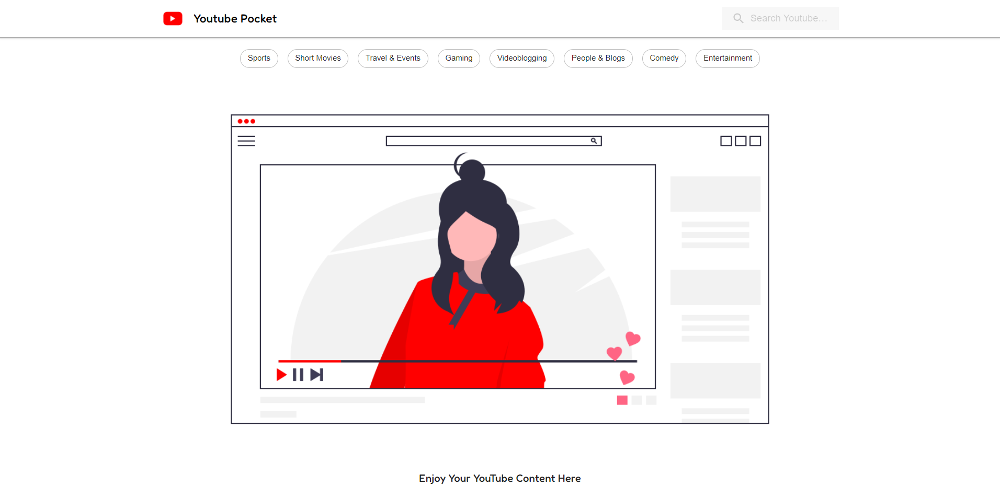

# Youtube Pocket

Build using React.js and Youtube API (from Google).Watch your favourite youtube content here.You may also select from the top categories which youtube suggests to watch.

### Landing Page

### Searching Youtube content 

### Watching a video from the search results

### Mobile reponsive
(Also an app walkthrough)

  

